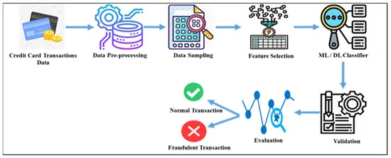

# Credit Card Fraud Detection Project



## Introduction

Welcome to my Credit Card Fraud Detection project! In this analysis, I aim to build a robust fraud detection model using various machine learning techniques. We'll embark on a journey through data exploration, visualization, preprocessing, model training, and performance evaluation.

### About the Dataset

The dataset at the heart of this project is a simulated credit card transaction dataset, spanning from January 1, 2019, to December 31, 2020. It comprises transactions from 1000 customers interacting with 800 merchants.

### Source of Simulation

To create this dataset, I utilized the Sparkov Data Generation tool, a handy resource available on [GitHub](https://github.com/username/Sparkov-Data-Generation) and developed by Brandon Harris. The simulation covers the period mentioned above, and the generated files were amalgamated and converted into a standardized format.

#### Description of Columns within the Dataset

- **Unnamed: 0:** Unique identifier for each record.
- **trans_date_trans_time:** Date and time of the transaction.
- **cc_num:** Credit card number used in the transaction.
- **merchant:** Name of the merchant where the transaction occurred.
- **category:** Category to which the transaction belongs.
- **amt:** Transaction amount.
- **first:** First name of the credit card holder.
- **last:** Last name of the credit card holder.
- **gender:** Gender of the credit card holder.
- **street:** Street address of the credit card holder.
- **city:** City where the credit card holder resides.
- **state:** State where the credit card holder resides.
- **zip:** ZIP code of the credit card holder.
- **lat:** Latitude of the transaction location.
- **long:** Longitude of the transaction location.
- **city_pop:** Population of the city where the credit card holder resides.
- **job:** Occupation of the credit card holder.
- **dob:** Date of birth of the credit card holder.
- **trans_num:** Unique transaction number.
- **unix_time:** Transaction time in Unix timestamp format.
- **merch_lat:** Latitude of the merchant location.
- **merch_long:** Longitude of the merchant location.
- **is_fraud:** Binary indicator of whether the transaction is fraudulent (1) or not (0).

### Step 1: Load and Explore Data

```python
# Let's kick things off by loading the datasets and gaining some insights into the data.
import pandas as pd
import numpy as np
import matplotlib.pyplot as plt
import seaborn as sns

# Load the datasets
train_data = pd.read_csv('fraudTrain.csv')
test_data = pd.read_csv('fraudTest.csv')

# Dive into the basic information of the datasets
print("Train Data Info:")
print(train_data.info())
print("\nTest Data Info:")
print(test_data.info())

# Peek into the first few rows of the train dataset
print(train_data.head())
print(test_data.head())
```

### Step 2: Data Cleaning

```python
# It's essential to ensure the data is clean. Let's check for missing values and take necessary actions.
# Check for missing values in both datasets
print(train_data.isnull().sum())
print(test_data.isnull().sum())

# Remove rows with missing values
train_data.dropna(inplace=True)
test_data.dropna(inplace=True)
```

### Step 3: Exploratory Data Analysis (EDA)

Now, let's delve into various aspects of the data, unraveling insights and patterns through visualizations.

```python
# Display summary statistics of the train dataset
print(train_data.describe())

# Visualize the distribution of the target variable (fraudulent or not)
plt.figure(figsize=(8, 6))
sns.countplot(x='is_fraud', data=train_data)
plt.title('Distribution of Fraudulent Transactions')
plt.xlabel('Is Fraud')
plt.ylabel('Count')
plt.show()

# Explore the distribution of transaction amounts by fraud status
# (Continue with additional EDA visualizations as needed)
```

Continue with the exploration, analyzing transaction amounts, categorical features, time-based patterns, geographical distribution, transaction frequency, and more.

### Step 4: Preprocessing and Feature Engineering

```python
# Now, let's prepare the data for model training by encoding categorical variables, scaling features,
# and generating synthetic data to balance the imbalanced dataset.
# Additionally, we'll train various machine learning models (Logistic Regression, SVM, KNN, Random Forest, MLP, SGD, Extra Trees),
# and evaluate their performance using metrics such as accuracy, ROC score, F1 score, precision, and recall.
```

Continue with the preprocessing steps, feature engineering, and model training as per your analysis requirements.

### Model Evaluation and Comparison

```python
# Evaluate and compare the performance of different models on the test dataset
# Calculate accuracy, ROC score, F1 score, precision, and recall for each model
# Present the results in a tabular format
# Visualize ROC curves and confusion matrices for each model
```

### Conclusion

Summarizing the journey, I've uncovered key insights and built models to detect credit card fraud. The results are promising, but there's always room for improvement. I'll reflect on challenges faced and consider potential enhancements for future iterations of the fraud detection model.

### Acknowledgments

I extend my gratitude to Brandon Harris for developing the Sparkov Data Generation tool, which greatly facilitated the simulation process.

## Getting Started

To explore this project, follow these steps:

1. Clone this repository: `git clone https://github.com/your-username/your-repository.git`
2. Navigate to the project directory: `cd your-repository`
3. Open and run the Jupyter Notebook or Python script.

Feel free to contribute, provide feedback, or report issues. Happy coding!
